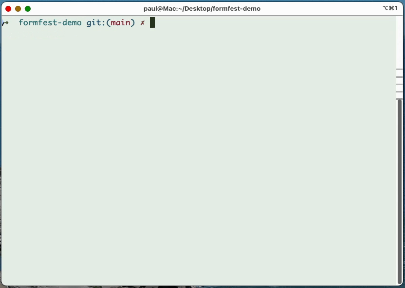

<div align="center">
  <h1>Apply.AI</h1>
  <p>FormFest 2024 Demo Project</p>
  <p><em>⚠️ This is a test project, it is not production ready. ⚠️</em></p>
</div>

## About

Apply.AI is a demonstration of an AI assistant who checks if you are registered to vote in Ontario.

The demo is meant as an _illustrative example_ of an intelligent assistant that builds a profile of the user over time and can therefore anticipate the data to be input when it sees appropriate form fields.

The demo uses [playwright](https://playwright.dev) to script form-filling and pings the [OpenAI API](https://platform.openai.com/docs/overview) for input validation.

### Running the app

This app is just a big script that will load the site to Register to vote in Ontario and then guide the user through the form by asking simple questions.

I have left in my name in the data.json file but you can sub it out for your own and try it out. Note that it is stopped by captchas, so you have to click through that part manually.

Once you have added your OpenAI API key (see below), you can run the app like this:

```sh
node vote.js
```

### OpenAI API key

To run this demo, you need to create `.env` at the root of the project with a valid OpenAI API key.

See `.env.example` for a sample format.

### gif

This is an animated gif of the first few questions of the Formfest Apply.AI demo.



## Contact

Reach out to me at paul "at" pcraig.ca if you have questions.
